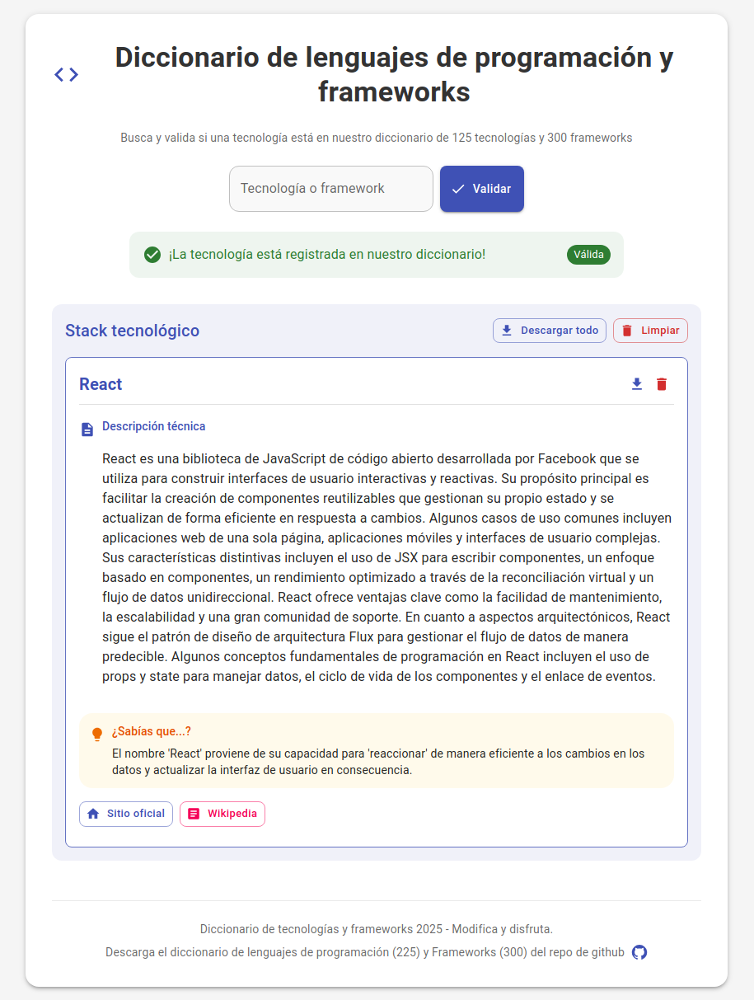

# Diccionario de Lenguajes de Programación y Frameworks


Una aplicación para validar y crear stacks tecnológicos a partir de un diccionario curado de 225 lenguajes de programación y 300 frameworks de desarrollo de software.



## 🌟 Características

- **Validación de tecnologías**: Verifica si una tecnología está incluida en nuestro diccionario curado
- **Creación de stacks**: Añade tecnologías validadas a tu stack personalizado
- **Interfaz minimalista**: Diseño limpio y enfocado en la usabilidad
- **Sin autocompletado intrusivo**: Campo de texto simple sin desplegables automáticos
- **Respuesta visual**: Indicación clara mediante colores e iconos
- **Gestión del stack**: Elimina tecnologías individuales o limpia todo el stack

## 📋 Contenido del proyecto

- **Aplicación React**: Interfaz para validar y gestionar tu stack tecnológico
- **Base de datos CSV**: Listado curado de [225 lenguajes y 300 frameworks](./data/lenguajes_frameworks.csv) organizado por categorías
- **Script de inicio**: Script `iniciar.sh` para arrancar fácilmente la aplicación

## 📥 Descarga directa del diccionario

Puedes descargar directamente nuestro diccionario de lenguajes y frameworks desde estos enlaces:

- **[⬇️ Descargar CSV completo](https://raw.githubusercontent.com/686f6c61/diccionario-lenguajes-programacion-frameworks/main/data/lenguajes_frameworks.csv)** - Contiene 225 lenguajes y 300 frameworks organizados por categorías
- **[📊 Ver en GitHub](https://github.com/686f6c61/diccionario-lenguajes-programacion-frameworks/blob/main/data/lenguajes_frameworks.csv)** - Explorar el archivo en el repositorio

El diccionario está en formato CSV y puede ser importado en Excel, Google Sheets, o cualquier herramienta de procesamiento de datos.

## 🚀 Instalación

### Requisitos previos

- Node.js (versión 14 o superior)
- npm (versión 6 o superior)

### Pasos de instalación

1. Clona el repositorio:
```bash
git clone https://github.com/686f6c61/diccionario-lenguajes-programacion-frameworks.git
cd diccionario-lenguajes-programacion-frameworks
```

2. Instala las dependencias:
```bash
npm install
```

O instala específicamente las dependencias requeridas:
```bash
npm install react react-dom @mui/material @mui/icons-material @emotion/react @emotion/styled papaparse
```

3. Inicia la aplicación:

Usando npm:
```bash
npm start
```

O usando el script proporcionado (recuerda que está dentro de la carpeta validador-tecnologias):
```bash
chmod +x validador-tecnologias/iniciar.sh  # Solo la primera vez para dar permisos de ejecución
./validador-tecnologias/iniciar.sh
```

La aplicación se abrirá automáticamente en [http://localhost:3000](http://localhost:3000).

## 🔍 Uso

1. **Buscar y validar tecnologías**:
   - Escribe el nombre de una tecnología o framework en el campo de texto
   - Haz clic en el botón "Validar" o presiona Enter
   - Verás un mensaje indicando si la tecnología está incluida en nuestro diccionario

2. **Crear tu stack tecnológico**:
   - Las tecnologías validadas correctamente se añaden automáticamente a tu stack
   - Cada tecnología aparecerá como un tag en la sección "Tu stack tecnológico"
   - Puedes eliminar tecnologías individuales o limpiar todo el stack

3. **Acceder al diccionario completo**:
   - El archivo CSV completo está disponible en la carpeta [data/lenguajes_frameworks.csv](./data/lenguajes_frameworks.csv)
   - Contiene 225 lenguajes y 300 frameworks organizados por categorías

## 📁 Estructura del proyecto

```
diccionario-lenguajes-programacion-frameworks/
├── README.md                   # Este archivo
├── validador-tecnologias/      # Directorio principal de la aplicación
│   ├── iniciar.sh              # Script para iniciar la aplicación
│   ├── package.json            # Dependencias y scripts
│   ├── data/                   # Datos del proyecto
│   │   └── lenguajes_frameworks.csv # Diccionario completo de tecnologías
│   ├── docs/                   # Documentación e imágenes
│   │   └── home.png         # Vista previa de la aplicación
│   ├── public/                 # Archivos estáticos
│   └── src/                    # Código fuente
│       ├── App.js              # Componente principal
│       ├── index.js            # Punto de entrada
│       ├── index.css           # Estilos globales
│       ├── components/         # Componentes React
│       │   └── TechnologyValidator.js # Validador de tecnologías
│       └── data/               # Datos para la aplicación
│           └── technologies.js # Procesamiento de tecnologías
```

## 📜 Script iniciar.sh

El script `iniciar.sh` permite arrancar la aplicación de forma rápida y sencilla:

```bash
./validador-tecnologias/iniciar.sh
```

Este script realiza las siguientes acciones:
1. Verifica que está en el directorio correcto
2. Instala las dependencias si no están instaladas
3. Inicia la aplicación en http://localhost:3000

## 🛠️ Tecnologías utilizadas

- **React**: Framework para la interfaz de usuario
- **Material-UI**: Componentes de diseño visual
- **PapaParse**: Procesamiento de archivos CSV
- **Node.js**: Entorno de ejecución JavaScript

## 📊 Datos y estadísticas

El diccionario incluye:
- 225 lenguajes y tecnologías de programación
- 300 frameworks y librerías
- 29 categorías diferentes de tecnologías
- Datos curados y organizados manualmente

## 📄 Licencia

Este proyecto está bajo la licencia MIT. Puedes modificarlo y disfrutarlo libremente.

## 🔗 Enlaces

- [Repositorio GitHub](https://github.com/686f6c61/diccionario-lenguajes-programacion-frameworks)
- [Reportar un problema](https://github.com/686f6c61/diccionario-lenguajes-programacion-frameworks/issues)
